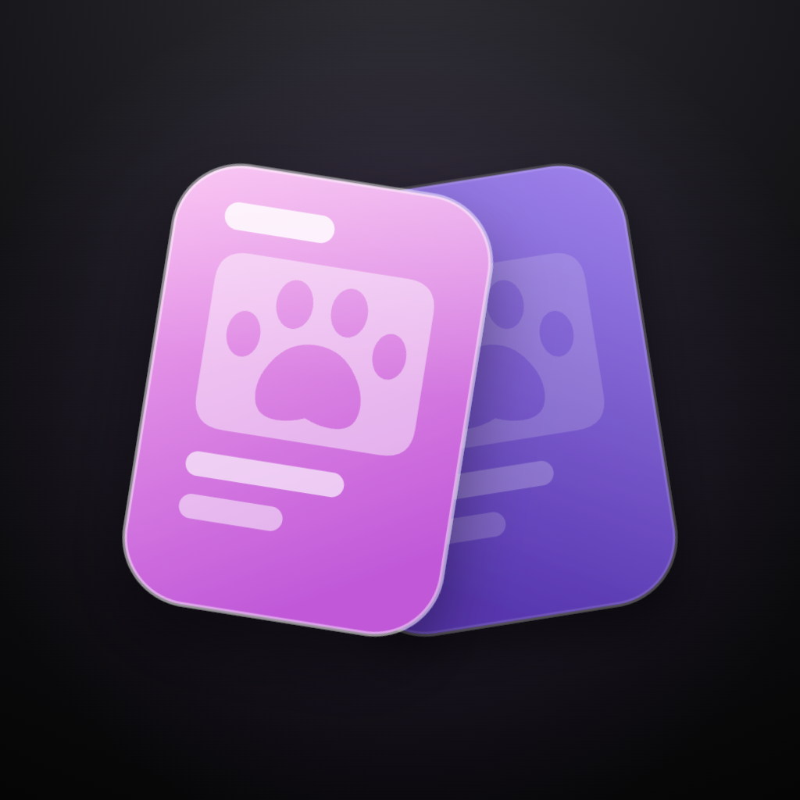

  

<h1 align="center">Furcards</h1>

Furcards is a StreetPass-style trading card app for fursonas. Leave it running
and it quietly collects the cards of other users you pass by over Bluetooth. Bump
phones with someone to trade full cards and add each other as friends.

> **Alpha / proof of concept.** This is early and rough. Expect bugs, missing
> features, and breaking changes. It is not on the App Store yet.

## How it works

- **Walk-by**: nearby phones swap a stripped-down "common" card over BLE, so your
  collection fills up as you go about your day.
- **Bump**: when two people both open each other's card and tap Bump, they trade
  the full card, including friends-only links.
- **No accounts, no server for cards**: identity is an Ed25519 keypair kept in the
  Keychain, and cards are signed blobs that travel directly between phones. There
  is no login and no central card database.
- **Backup and transfer**: settings and your collection mirror to your own iCloud
  Drive container, and there is a passphrase-encrypted export for moving your
  identity and collection between devices.

## Layout

- `Furcards/` — the SwiftUI iOS app.
- `Frameworks/FurcardsCore.xcframework` — the shared protocol/crypto core, built
  from the Kotlin Multiplatform module in the Android repo. Resync it with
  `scripts/refresh-core.sh`.
- `FurcardsTests/` — golden-vector tests that pin the iOS side to the same wire
  format and signatures the Android app uses.
- `backend/` — a small static site serving the legal pages and the Android alpha
  build. The app itself does not depend on it.

## Building

Open `Furcards.xcodeproj` in Xcode and run the `Furcards` scheme on a device.
BLE does not work in the simulator, so trading needs real hardware.
